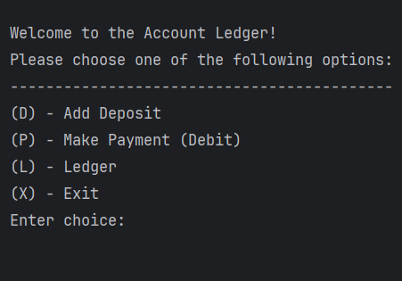
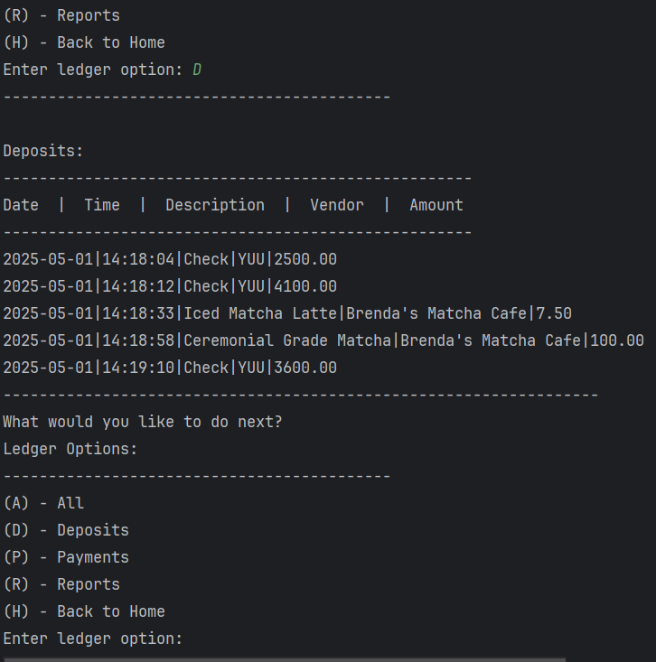
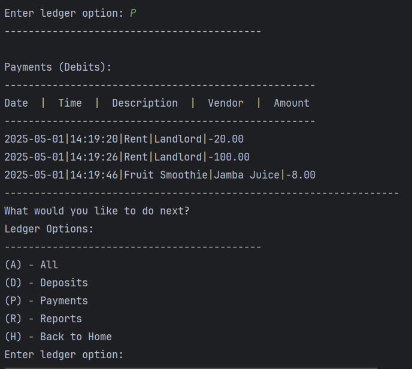

README Template:

# Brenda's Accounting Ledger App

This is a simple accounting ledger application built in Java. It allows users to add, view, and manage financial transactions via a text-based menu.

  ### Home Screen

p>

  ### Transactions
  
  

## Interesting Code Snippet

Here’s one part of the project I’m proud of—how transactions are parsed from a line in a CSV file:

private static void generateMonthToDateReport() {
    System.out.println("\nMonth To Date Report:");
    LocalDate now = LocalDate.now();

    List<Transactions> mtdTransactions = loadTransactions().stream()
        .filter(transaction -> transaction.getDate().getYear() == now.getYear()
            && transaction.getDate().getMonth() == now.getMonth())
        .collect(Collectors.toList());

    displayTransactions(mtdTransactions);
}

## This explains:

loadTransactions() loads all the transactions from a file.

.stream() turns the list into a stream for processing.

.filter(...) narrows the results to only the current month and year.

.collect(Collectors.toList()) converts the stream back into a List for display.
